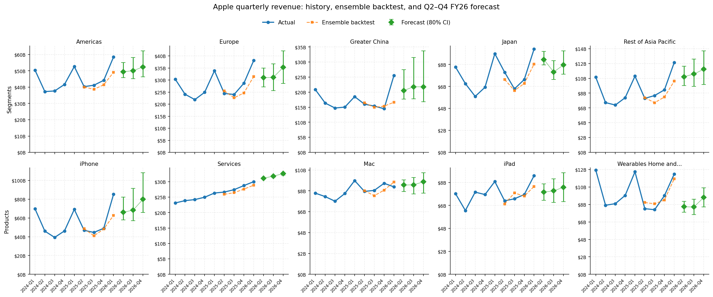
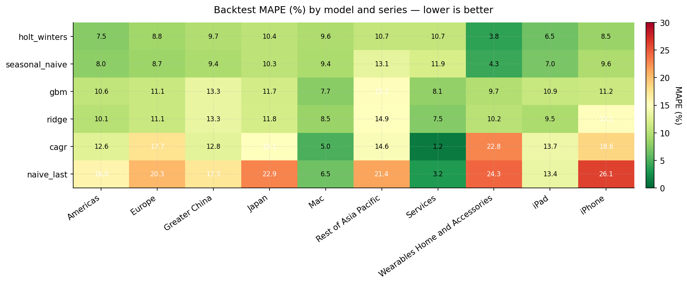
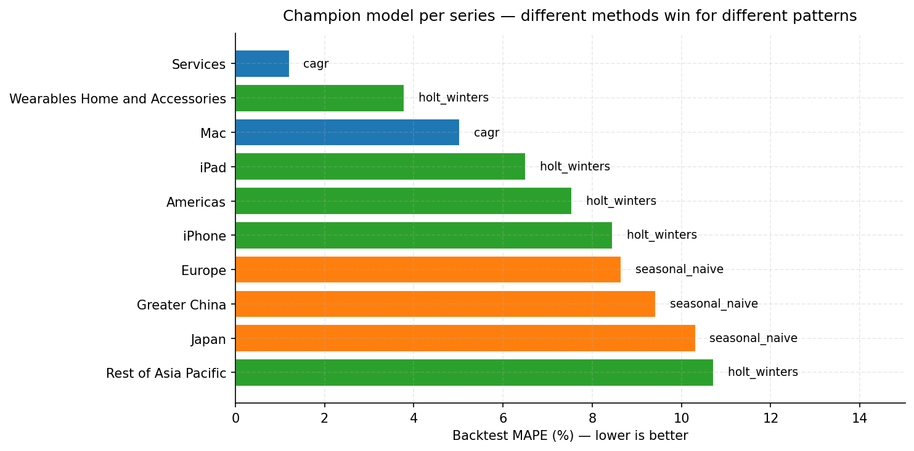

# Apple Retail Demand Forecasting & Promotional Impact Analyzer

> An end-to-end finance project built around Apple's FY2025 10-K and
> FY2025-FY2026 10-Q filings. Demonstrates the SQL, forecasting,
> AI/automation, and business-partnering skill set — applied to real public
> filings, with every number reconciled to source.

[]()
[]()
[]()
[]()
[]()
[]()

## Start here

If you have 60 seconds, read **[`docs/executive_memo.md`](docs/executive_memo.md)** —
the 2-page memo that's the actual deliverable a Retail Finance analyst
would write off this work. Four insights, four recommendations.

If you have 5 minutes:
- **[`docs/interactive_forecast.html`](docs/interactive_forecast.html)** — open in any browser. Hover any point for exact values; switch between segments and products; toggle the 6 base models or the 80% CI band; see how Q2/Q3/Q4 FY26 forecasts and their confidence bands evolve across the horizon.
- **[`docs/portfolio_deck.pptx`](docs/portfolio_deck.pptx)** — 8-slide walkthrough designed for a recruiter screen or "tell me about a project" interview moment.
- **[`docs/methodology.md`](docs/methodology.md)** — model selection rationale and honest limitations.
- **[`data/processed/commentary/fy2026_q1_vs_fy2025_q1_validation.txt`](data/processed/commentary/fy2026_q1_vs_fy2025_q1_validation.txt)** — the LLM commentary validator showing 28/28 numbers grounded.

If you have 30 minutes, the rest of this README walks the full stack.



---

## Why this project

Apple's Retail Finance team forecasts weekly and quarterly demand by product,
country, and channel; partners with Geo leadership on go-to-market decisions;
and is increasingly expected to bring AI/automation to the financial-reporting
stack. The JD lists **SQL, Tableau, and AI/ML** as preferred skills.

This project demonstrates all four pillars of the role on real Apple data:

| Pillar (from JD)      | Where it shows up in the repo                                          |
|-----------------------|------------------------------------------------------------------------|
| Strategic Analysis    | `docs/executive_memo.md` — 4 actionable insights for Retail leadership |
| Forecasting           | `scripts/forecast_models.py` + `scripts/run_forecast.py` — 6-model ensemble across 3 horizons |
| Business Partnering   | `notebooks/02_forecast.py` — narrative for cross-functional review     |
| Process Innovation    | `scripts/generate_commentary.py` — LLM-drafted variance commentary     |

## Four insights in 30 seconds (full version in `docs/executive_memo.md`)

1. **Services is now the gross-margin lever, not hardware.** Mix shift to
   Services drove ~75% of the FY23→FY25 GM expansion (44.1% → 46.9%).
   Services FY26 forecast trajectory is $31.1B → $31.8B → $32.6B with the
   tightest CI in the bundle (~$0.5B per quarter).

2. **Greater China is the highest-uncertainty line, and the band widens
   with horizon.** After 4 declining quarters, +37.9% YoY in Q1 FY26.
   Forecast trajectory: $20.5B (Q2) → $21.8B (Q3) → $21.8B (Q4). 80% CI
   width grows from $9.7B at Q2 to $16.9B at Q4 — the √h scaling makes
   horizon uncertainty visible. Two scenarios are equally consistent with
   the data; weekly sell-through telemetry should resolve them within six
   weeks.

3. **Wearables in 2-year decline is masking a Services ARPU question.**
   -7.1% / -3.6% / -2.2% across FY24 / FY25 / Q1 FY26. Watch and AirPods
   attach rate softening matters for the long-range plan's Services
   lifetime-value math, regardless of the Q4 holiday bounce in the forecast.

4. **The iPhone forecast hinges on a $6.3B bias correction at every
   horizon.** Bias-corrected trajectory: $66.1B → $68.4B → $79.9B
   (+41 / +53 / +63% YoY). Raw model is ~$6B lower at every horizon.
   The wider the horizon, the more this single judgment call matters —
   show floor and central case explicitly in any plan that uses these
   numbers.

## Forecast highlights — Q2 / Q3 / Q4 FY2026

The ensemble produces 30 forecast rows (10 series × 3 horizons), each with
its own bias-corrected point and 80% bootstrap interval. CIs widen at
longer horizons because residuals are scaled by √h before bootstrapping
(standard random-walk approximation; we don't have enough sample to
backtest at h>1 cleanly).

| Series                          | Q2 FY26       | Q3 FY26       | Q4 FY26       | Champion       | MAPE   |
|---------------------------------|---------------|---------------|---------------|----------------|-------:|
| iPhone                          | $66.1B        | $68.4B        | $79.9B        | holt_winters   | 8.45%  |
| Americas                        | $49.4B        | $50.1B        | $52.4B        | holt_winters   | 7.54%  |
| Europe                          | $31.0B        | $31.1B        | $35.3B        | seasonal_naive | 8.66%  |
| Services                        | $31.1B        | $31.8B        | $32.6B        | cagr           | 1.21%  |
| Greater China                   | $20.5B        | $21.8B        | $21.8B        | seasonal_naive | 9.42%  |
| Rest of Asia Pacific            | $10.2B        | $10.6B        | $11.2B        | holt_winters   | 10.73% |
| Mac                             | $8.6B         | $8.6B         | $8.9B         | cagr           | 5.03%  |
| Japan                           | $8.5B         | $7.3B         | $8.0B         | seasonal_naive | 10.32% |
| Wearables H&A                   | $7.7B         | $7.7B         | $8.8B         | holt_winters   | 3.78%  |
| iPad                            | $7.2B         | $7.3B         | $7.6B         | holt_winters   | 6.51%  |
| **Segment total**               | **$119.6B**   | **$120.9B**   | **$128.6B**   |                |        |
| **Product total**               | **$120.7B**   | **$123.8B**   | **$137.8B**   |                |        |

Segment and product totals reconcile within 0.9% at Q2, 2.4% at Q3, and
7.1% at Q4 — a useful diagnostic showing how multi-step compounding affects
top-down agreement. Champion model identification uses 1-step backtest
MAPE; the same champion is used at all horizons (a documented assumption,
see `docs/methodology.md`).

**Backtest performance — different models win for different patterns.**
No single technique dominates; champion-challenger by series is the
honest pattern a senior analyst would surface to leadership.





See `docs/methodology.md` for the full technical writeup on model selection,
walk-forward CV, ensemble construction, bias correction, and multi-horizon
CI scaling.

## AI-drafted variance commentary (with hallucination guardrails)

Variance commentary is repetitive, structured prose that FP&A teams write
every quarter. The pipeline in `scripts/generate_commentary.py` automates
the first draft using the Anthropic Claude API, with a dedicated validation
layer that catches the cardinal LLM-in-finance failure mode: confidently
inventing plausible-sounding numbers.

**Three-layer architecture:**

1. **`commentary_brief.py`** — Structured JSON brief generator. The model
   never reads the database directly; it sees only this brief, which contains
   every fact it's permitted to use. Three brief types: period-over-period
   (e.g. Q1 FY26 vs Q1 FY25), year-over-year (FY25 vs FY24), and
   forecast-vs-baseline (any of Q2/Q3/Q4 FY26 vs the same quarter prior year).

2. **`commentary_client.py`** — Wraps the Anthropic Messages API with a
   carefully-engineered system prompt establishing senior FP&A analyst
   persona, structural requirements (3-4 paragraphs, 250-350 words, markdown
   bold), and the **critical constraint that the model must use ONLY numbers
   from the brief**. Falls back to a dry-run mode (prints the formed prompt)
   when no API key is set, so the pipeline is testable end-to-end without
   credentials.

3. **`commentary_validator.py`** — Number-grounding validator. After Claude
   responds, every dollar amount and percentage in the prose is extracted
   via regex, normalized to a common unit, and matched against facts in
   the brief. The matcher is **sentence-scoped and entity-aware**: when an
   entity name (e.g. "Greater China") appears in the same sentence as a
   number, candidate matches are restricted to that entity's facts. This
   catches misattributions where a hallucinated number happens to coincide
   with a real figure for a different entity.

**Worked example — Q1 FY26 vs Q1 FY25 commentary:**

```
======================================================================
Number-grounding validation
======================================================================
Verified:    28
Unverified:  0
Result:      PASS

[OK]  $143.8B -> consolidated.current_millions
[OK]  $124.3B -> consolidated.prior_millions
[OK]  +15.6%  -> consolidated.change_pct
[OK]  $25.5B  -> by_segment.Greater China.current_millions
[OK]  +37.9%  -> by_segment.Greater China.change_pct
[OK]  +23.3%  -> by_product.iPhone.change_pct
[OK]  -6.7%   -> by_product.Mac.change_pct        ← signed match preferred
[OK]  +6.3%   -> by_product.iPad.change_pct          over abs-value match
... (28 numbers, all grounded)
```

Every dollar amount and percentage in Claude's output traces to a specific
path in the brief. If a number isn't grounded — even one that's plausible —
the pipeline exits with code 2 and surfaces the offending value for review.

## Tableau dashboard (spec)

Chunk 3 (Tableau workbook) was deferred when the project prioritized the
LLM commentary work. The data is already shaped for Tableau ingest —
`data/processed/forecasts/forecast_v1.csv` (multi-horizon),
`backtest_predictions.csv`, and the SQLite database can all be connected
to Tableau Desktop directly.

A reviewer with Tableau access can build a 4-sheet executive dashboard
in 30-60 minutes following this spec:

1. **Quarterly revenue trend (segments)** — line chart, x = period, y = revenue,
   color = segment. Filter to FY24–FY26. Layer the Q2/Q3/Q4 FY26 forecasts as
   diamond markers connected by a line, with error bars from `forecast_v1.csv`.

2. **Quarterly revenue trend (products)** — same chart structure for the five
   product categories. Highlight the iPhone 17 Q1 FY26 spike and the
   bias-corrected forecast trajectory through Q4 FY26.

3. **YoY growth scorecard** — heatmap with segments and products as rows,
   FY24 / FY25 / Q1 FY26 / Q2-Q4 FY26 forecasts as columns. Color encoding:
   diverging palette centered at zero growth. Driven from
   `02_analytical_queries.sql` Q2 and `03_quarterly_queries.sql` Q11/Q12.

4. **Forecast confidence panel** — 80% intervals from `forecast_v1.csv` as
   horizontal bars per series, faceted by horizon. Sort by interval width
   to surface highest-uncertainty lines (Greater China, iPhone) at the top.

The dashboard would have one global filter (FY/quarter range), one parameter
toggle (segment view vs product view) feeding sheets 1 and 2, and a horizon
selector (Q2 / Q3 / Q4 / All) on sheet 4. The interactive HTML viewer at
`docs/interactive_forecast.html` already implements an equivalent of sheets
1, 2, and 4 in a self-contained file.

## Generating commentary

```bash
# Period-over-period (most common)
python scripts/generate_commentary.py period --current 20261 --prior 20251

# Annual recap
python scripts/generate_commentary.py annual --current-fy 2025 --prior-fy 2024

# Forecast vs baseline (default = Q2 FY26 forecast vs Q2 FY25 actual)
python scripts/generate_commentary.py forecast --baseline 20252

# Forecast for Q3 FY26 vs Q3 FY25
python scripts/generate_commentary.py forecast --baseline 20253 --horizon 2

# Forecast for Q4 FY26 vs Q4 FY25
python scripts/generate_commentary.py forecast --baseline 20254 --horizon 3

# Dry-run mode — print the prompt without calling the API
python scripts/generate_commentary.py period --current 20261 --prior 20251 --dry-run
```

## Architecture

```
┌────────────────────┐    ┌──────────────────┐    ┌─────────────────────┐
│  10-K / 10-Q XBRL  │───►│  data/raw/*.csv  │───►│  SQLite star schema │
└────────────────────┘    └──────────────────┘    └──────────┬──────────┘
                                                              │
        ┌─────────────────────────────────────────────────────┼─────────────────────────┐
        ▼                       ▼                             ▼                         ▼
┌──────────────────┐  ┌────────────────────┐  ┌─────────────────────┐  ┌──────────────────────┐
│ Analytical SQL   │  │ Forecast pipeline  │  │ Interactive viewer  │  │ LLM commentary       │
│ (sql/02_*.sql,   │  │ 6-model ensemble,  │  │ Plotly HTML, hover  │  │ Brief → Claude API   │
│  sql/03_*.sql)   │  │ multi-horizon CIs  │  │ tooltips, series    │  │ → number-grounding   │
│                  │  │ (Q2/Q3/Q4 FY26)    │  │ selector            │  │ validator            │
└──────────────────┘  └────────────────────┘  └─────────────────────┘  └──────────────────────┘
```

## Repo layout

```
apple-retail-finance/
├── data/
│   ├── raw/              CSV extracts from the 10-K + quarterly XBRL extracts (commit-tracked)
│   │   └── quarterly/    Per-period CSVs from each 10-Q filing
│   └── processed/        SQLite DB and forecast outputs (gitignored, regenerable)
│       ├── forecasts/    forecast_v1.csv (30 rows: 10 series × 3 horizons),
│       │                 model_metrics.csv, champions.csv, backtest_predictions.csv,
│       │                 forecast_data.json (payload for the interactive viewer)
│       └── commentary/   Per-comparison brief.json, commentary.md, validation.json
├── sql/
│   ├── 01_schema.sql              Star-schema DDL with indexes and FKs
│   ├── 02_analytical_queries.sql  8 annual business-driven queries
│   └── 03_quarterly_queries.sql   6 quarterly queries inc. seasonality view for ML
├── scripts/
│   ├── build_database.py          Loader with reconciliation against 10-K/10-Q control totals
│   ├── parse_xbrl_10q.py          iXBRL parser for SEC EDGAR filing zips
│   ├── consolidate_quarterly.py   Combines per-period CSVs and derives Q4 by subtraction
│   ├── forecast_models.py         6 base forecasters + ensemble + walk-forward backtest
│   ├── run_forecast.py            Multi-horizon orchestrator (default: Q2/Q3/Q4 FY26)
│   ├── visualize_forecast.py      Generate publication-quality matplotlib charts
│   ├── build_interactive.py       Build the self-contained interactive Plotly viewer
│   ├── commentary_brief.py        Build typed JSON briefs from the database (3 flavors)
│   ├── commentary_client.py       Anthropic API wrapper (live + dry-run)
│   ├── commentary_validator.py    Sentence-scoped number-grounding validator
│   └── generate_commentary.py     CLI orchestrator — brief → API → validate → write
├── notebooks/
│   └── 02_forecast.py             Jupytext narrative — convert with `jupytext --to notebook`
├── docs/
│   ├── executive_memo.md          2-page memo with 4 actionable insights for Retail leadership
│   ├── portfolio_deck.pptx        8-slide walkthrough designed for recruiter screens
│   ├── interactive_forecast.html  Self-contained interactive Plotly viewer (open in browser)
│   ├── interactive_forecast_template.html    Template used by build_interactive.py
│   ├── data_dictionary.md         Column-by-column documentation of every table
│   ├── methodology.md             Forecast methodology, model rationale, multi-horizon CIs
│   └── figures/                   Static charts (MAPE heatmap, champions, forecast panels)
├── tests/
│   ├── test_database.py           30 tests covering schema, annual & quarterly reconciliation
│   ├── test_forecast.py           24 tests covering all 6 models, ensemble, multi-horizon CIs
│   └── test_commentary.py         21 tests covering briefs, validator, API client
├── LICENSE                        MIT, with explicit Apple non-affiliation disclaimer
├── requirements.txt
└── README.md (this file)
```

## Quickstart

```bash
# 1. Clone and set up
git clone <your-fork-url>
cd apple-retail-finance
python -m venv .venv && source .venv/bin/activate
pip install -r requirements.txt

# 2. Build the database (idempotent)
python scripts/parse_xbrl_10q.py path/to/aapl-YYYYMMDD.htm    # for each 10-Q filing
python scripts/consolidate_quarterly.py
python scripts/build_database.py
# expect: "Build complete: data/processed/apple_finance.db"

# 3. Run the test suite
pytest tests/ -v
# expect: 75 passed (30 database + 24 forecast + 21 commentary)

# 4. Run the multi-horizon forecast
python scripts/run_forecast.py
# Default horizons: 1 2 3 (Q2, Q3, Q4 FY26). Override with `--horizons 1 2`.
python scripts/visualize_forecast.py
# Outputs: data/processed/forecasts/forecast_v1.csv (30 rows)
#          docs/figures/01_mape_heatmap.png
#          docs/figures/02_champions.png
#          docs/figures/03_forecast_panels.png

# 5. Build the interactive forecast viewer
python scripts/build_interactive.py
# Outputs: docs/interactive_forecast.html (open in any browser)

# 6. Open the narrative notebook
jupytext --to notebook notebooks/02_forecast.py
jupyter notebook notebooks/02_forecast.ipynb

# 7. Explore the analytical SQL
sqlite3 data/processed/apple_finance.db < sql/02_analytical_queries.sql
sqlite3 data/processed/apple_finance.db < sql/03_quarterly_queries.sql
```

## Build status — chunk by chunk

- [x] **Chunk 1: Data layer** — CSVs, SQLite star schema, 8 analytical queries, test suite
- [x] **Chunk 1B: Quarterly granularity** — XBRL parser, 9 quarters loaded, 6 quarterly queries, seasonality view
- [x] **Chunk 2: Forecasting model** — 6-model walk-forward backtest, inverse-MAPE ensemble, bias-corrected multi-horizon forecasts (Q2/Q3/Q4 FY26) with 80% bootstrap CIs
- [x] **Chunk 4: LLM variance commentary** — Anthropic API integration, three brief types, sentence-scoped number-grounding validator
- [x] **Chunk 5: Executive memo + portfolio polish** — 2-page memo, 8-slide portfolio deck, interactive HTML viewer, LICENSE
- [ ] **Chunk 3: Tableau dashboard** — deferred (project priorities) — see "Tableau dashboard" section above for the dashboard spec a reviewer can build from. The interactive HTML viewer covers most of the functionality.

## Data sources

All financial data is extracted from Apple's publicly filed:

- **Form 10-K** for fiscal year ended September 27, 2025 (filed October 31, 2025)
- **Form 10-Q** for the quarter ended December 28, 2024 (Q1 FY2025)
- **Form 10-Q** for the quarter ended March 29, 2025 (Q2 FY2025)
- **Form 10-Q** for the quarter ended June 28, 2025 (Q3 FY2025)
- **Form 10-Q** for the quarter ended December 27, 2025 (Q1 FY2026)

The 10-Qs are parsed directly from SEC EDGAR's iXBRL submissions — the parser
in `scripts/parse_xbrl_10q.py` resolves XBRL contexts and dimension members
(`us-gaap:StatementBusinessSegmentsAxis`, `srt:ProductOrServiceAxis`) to extract
quarterly revenue. Q4 quarters are derived by subtraction from the 10-K
annual totals (Apple does not file a Q4 10-Q).

No proprietary or non-public information is used. All control totals reconcile
to the published filings:
- 6 annual reconciliations (segment + product, FY23-FY25)
- 10 quarterly reconciliations (5 segments × 2 fiscal years, 4 quarters each)
- 10 product reconciliations (5 categories × 2 fiscal years)

See `tests/test_database.py` and the build log for the full check.

## License

MIT — see `LICENSE`. This is a personal portfolio project and is not
affiliated with or endorsed by Apple Inc.
